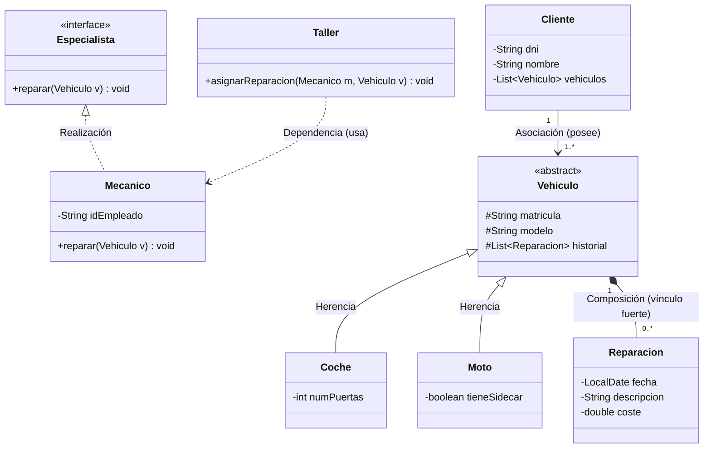

```mermaid
classDiagram
    class Especialista {
        <<interface>>
        +reparar(Vehiculo v) void
    }
 
    class Mecanico {
        -String idEmpleado
        +reparar(Vehiculo v) void
    }
 
    class Cliente {
        -String dni
        -String nombre
        -List~Vehiculo~ vehiculos
    }
 
    class Vehiculo {
        <<abstract>>
        #String matricula
        #String modelo
        #List~Reparacion~ historial
    }
 
    class Coche {
        -int numPuertas
    }
 
    class Moto {
        -boolean tieneSidecar
    }
 
    class Reparacion {
        -LocalDate fecha
        -String descripcion
        -double coste
    }
 
    class Taller {
        +asignarReparacion(Mecanico m, Vehiculo v) void
    }
 
    %% Relaciones
    Especialista <|.. Mecanico : Realización
    Vehiculo <|-- Coche : Herencia
    Vehiculo <|-- Moto : Herencia
    Cliente "1" --> "1..*" Vehiculo : Asociación (posee)
    Vehiculo "1" *-- "0..*" Reparacion : Composición (vínculo fuerte)
    Taller ..> Mecanico : Dependencia (usa)
```