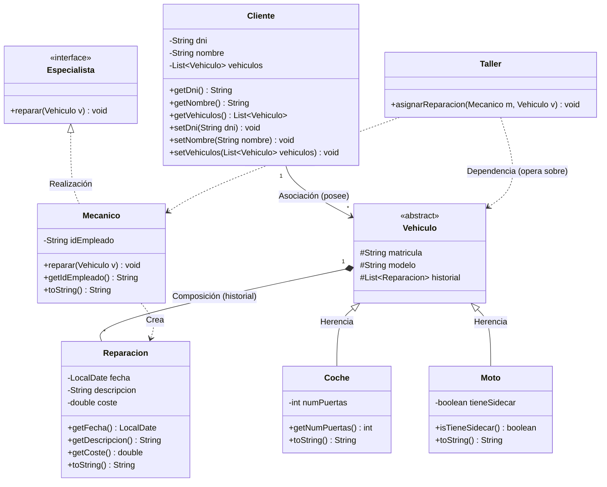

```mermaid
classDiagram
    class Especialista {
        <<interface>>
        +reparar(Vehiculo v) void
    }
 
    class Mecanico {
        -String idEmpleado
        +reparar(Vehiculo v) void
    }
 
    class Cliente {
        -String dni
        -String nombre
        -List~Vehiculo~ vehiculos
    }
 
    class Vehiculo {
        <<abstract>>
        #String matricula
        #String modelo
        #List~Reparacion~ historial
    }
 
    class Coche {
        -int numPuertas
    }
 
    class Moto {
        -boolean tieneSidecar
    }
 
    class Reparacion {
        -LocalDate fecha
        -String descripcion
        -double coste
    }
 
    class Taller {
        +asignarReparacion(Mecanico m, Vehiculo v) void
    }
 
    %% Relaciones
    Especialista <|.. Mecanico : IMplementación
    Vehiculo <|-- Coche : Herencia
    Vehiculo <|-- Moto : Herencia
    Cliente "1" --> "1..*" Vehiculo : Asociación (posee)
    Vehiculo "1" *-- "0..*" Reparacion : Composición (vínculo fuerte)
    Taller ..> Mecanico : Dependencia (usa)
```

## Ingeniería Inversa - Diagrama de Clases (Actualizado)

A continuación se muestra el diagrama de clases generado a partir del código fuente actual, incluyendo atributos y métodos principales:

```mermaid
classDiagram
    class Especialista {
        <<interface>>
        +reparar(Vehiculo v) void
    }

    class Mecanico {
        -String idEmpleado
        +reparar(Vehiculo v) void
        +getIdEmpleado() String
        +toString() String
    }

    class Cliente {
        -String dni
        -String nombre
        -List~Vehiculo~ vehiculos
        +getDni() String
        +getNombre() String
        +getVehiculos() List~Vehiculo~
        +setDni(String dni) void
        +setNombre(String nombre) void
        +setVehiculos(List~Vehiculo~ vehiculos) void
    }

    class Vehiculo {
        <<abstract>>
        #String matricula
        #String modelo
        #List~Reparacion~ historial
    }

    class Coche {
        -int numPuertas
        +getNumPuertas() int
        +toString() String
    }

    class Moto {
        -boolean tieneSidecar
        +isTieneSidecar() boolean
        +toString() String
    }

    class Reparacion {
        -LocalDate fecha
        -String descripcion
        -double coste
        +getFecha() LocalDate
        +getDescripcion() String
        +getCoste() double
        +toString() String
    }

    class Taller {
        +asignarReparacion(Mecanico m, Vehiculo v) void
    }

    %% Relaciones detectadas
    Especialista <|.. Mecanico : Realización
    Vehiculo <|-- Coche : Herencia
    Vehiculo <|-- Moto : Herencia
    Cliente "1" --> "*" Vehiculo : Asociación (posee)
    Vehiculo "1" *-- "*" Reparacion : Composición (historial)
    Taller ..> Mecanico : Dependencia (usa)
    Taller ..> Vehiculo : Dependencia (opera sobre)
    Mecanico ..> Reparacion : Crea
```
